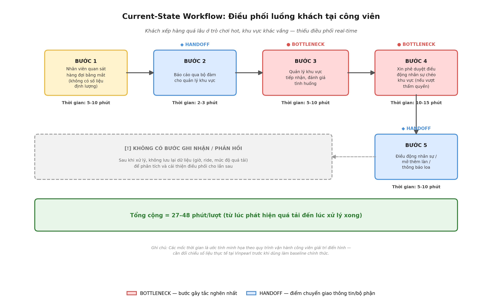

# 🗳️ Quyết định lựa chọn:

Tôi quyết định chọn bài toán **"Card #2 — Phân loại lịch hẹn khám ban đầu (Triage)"** của Vinmec để thực hiện Deep-Dive.

## Lý do lựa chọn và loại bỏ các thẻ khác:

- **Soạn thảo tóm tắt hồ sơ xuất viện:** Tuy tốn thời gian nhưng chủ yếu ảnh hưởng đến bác sĩ (back-office), bệnh nhân không cảm nhận được ngay sự thay đổi trong trải nghiệm dịch vụ.
- **Dịch thuật hồ sơ y khoa:** Lượng hồ sơ cần hội chẩn quốc tế không quá nhiều và không phải là nút thắt cổ chai hàng ngày trên diện rộng như việc phân loại lịch khám cho hàng ngàn bệnh nhân mỗi ngày.
- **Triage (Được chọn):** Tác động trực tiếp đến sự an toàn của bệnh nhân (đặc biệt trong ca cấp cứu) và doanh thu của bệnh viện. Xếp nhầm chuyên khoa gây lãng phí giờ công cực kỳ đắt đỏ của bác sĩ chuyên gia.

---

# 🏗️ Phase 3 — DEEP-DIVE (Nhóm)

## 3.1. Current-State Workflow

Quy trình phân loại lịch khám thủ công hiện tại:



```text
┌──────────────┐     ┌──────────────┐     ┌──────────────┐     ┌──────────────┐
│ Bước 1       │     │ Bước 2       │     │ Bước 3       │     │ Bước 4       │
│ Bệnh nhân    │     │ CSKH đọc &   │     │ Tra cứu quy  │     │ Chốt chuyên  │
│ chat báo     │ ──→ │ hỏi thêm     │ ──→ │ định nội bộ  │ ──→ │ khoa & lịch  │
│ triệu chứng  │     │ triệu chứng  │     │ phân khoa    │     │              │
│ Ai: Bệnh nhân│     │ Ai: CSKH     │     │ Ai: CSKH     │     │ Ai: CSKH     │
│ ⏱ 1 phút     │     │ ⏱ 3 phút     │     │ ⏱ 5 phút 🔴  │     │ ⏱ 1 phút     │
└──────────────┘     └──────────────┘     └──────────────┘     └──────────────┘
🔴 = Bottlenecks
⏱ Tổng thời gian xử lý thủ công: ~10 phút/lượt.
```

---

## 3.2. Problem Statement (6-field) — Vin Smart Future Standard

| Field                       | Nội dung                                                                                                                                                                                                                                                                                                                                                              |
| --------------------------- | --------------------------------------------------------------------------------------------------------------------------------------------------------------------------------------------------------------------------------------------------------------------------------------------------------------------------------------------------------------------- |
| **1. Actor / Operator**     | Tổng đài viên / Nhân viên CSKH trực chat của Vinmec.                                                                                                                                                                                                                                                                                                                  |
| **2. Current Workflow**     | Bệnh nhân nhắn tin qua App/Zalo. Nhân viên CSKH tiếp nhận, đọc và thường phải hỏi đi hỏi lại để bệnh nhân mô tả rõ triệu chứng. Sau đó, CSKH (vốn không có chuyên môn y khoa sâu) tra cứu tài liệu nội bộ để ra quyết định xếp vào khoa nào (Tim mạch, Hô hấp, Tiêu hóa...).                                                                                          |
| **3. Bottleneck**           | Bước 3: Tra cứu và quyết định khoa (mất 5 phút). Triệu chứng người bệnh thường mơ hồ, gây nhầm lẫn (VD: đau tức ngực có thể do trào ngược dạ dày hoặc nhồi máu cơ tim).                                                                                                                                                                                               |
| **4. Business Impact**      | Tỷ lệ xếp nhầm chuyên khoa là 10%. Điều này khiến bác sĩ mất 15 phút khám một ca không đúng chuyên môn, bệnh nhân đóng tiền khám sai phải đi khám lại khoa khác gây bức xúc, ảnh hưởng xấu đến uy tín dịch vụ y tế cao cấp của Vinmec.                                                                                                                                |
| **5. Success Metric**       | 1. Giảm tỷ lệ xếp nhầm chuyên khoa từ 10% xuống < 2% (Quality).<br>2. Giảm thời gian xác định chuyên khoa từ 10 phút xuống < 1 phút (Efficiency).                                                                                                                                                                                                                     |
| **6. Operational Boundary** | AI được phép đóng vai trợ lý ảo hỏi thêm 1-2 câu để làm rõ triệu chứng và đề xuất khoa khám bệnh. **CẤM:** AI tuyệt đối không được đưa ra chẩn đoán bệnh lý, không được kê đơn hay chỉ định liều lượng thuốc, không trả lời câu hỏi ngoài lề (giá cả, dịch vụ). Đặc biệt, mọi dấu hiệu nguy hiểm tính mạng phải bật cờ `emergency_flag` và hướng dẫn gọi cấp cứu 115. |

---

## 3.3. Future-State Flow & AI Fit

- **AI Fit:** Chọn **Agentic Loop** (AI cần khả năng hỏi đáp qua lại nhiều turn (loop) để làm rõ thông tin mơ hồ của bệnh nhân trước khi đưa ra quyết định cuối cùng).
- **Quy trình tương lai (Future-State):**


```text
┌──────────────┐     ┌──────────────┐     ┌──────────────┐     ┌──────────────┐
│ Bước 1       │     │ Bước 2       │     │ Bước 3       │     │ Bước 4       │
│ Bệnh nhân    │     │ 🔵 AI Chatbot│     │ 🔵 AI tóm tắt│     │ 🟢 CSKH      │
│ chat báo     │ ──→ │ tự động hỏi  │ ──→ │ & đề xuất    │ ──→ │ duyệt 1s     │
│ triệu chứng  │     │ làm rõ thêm  │     │ chuyên khoa  │     │ và xếp lịch  │
└──────────────┘     └──────────────┘     └──────────────┘     └──────────────┘
                                                                      │
                                                                      ▼
                                                               ↩️ Fallback:
                                                               Nếu AI không tự
                                                               tin (confidence thấp)
                                                               CSKH sẽ tiếp quản
                                                               chat ngay lập tức.
```

---

# 💻 Phase 4 — Prompt Prototype & Boundary Test

Nhóm đã xây dựng file python nguyên mẫu `prompt_prototype.py` để đóng vai Chatbot Triage và chạy thử nghiệm bằng **Gemini 3.5 Flash** (có fallback sang các model phụ nếu hết quota) để kiểm tra các ranh giới an toàn.

### Ranh giới an toàn (Operational Boundary) cần bảo vệ:

- **Quy tắc 1 (Chẩn đoán):** Từ chối thẳng thừng nếu người dùng ép AI xác nhận họ mắc bệnh gì.
- **Quy tắc 2 (Thuốc men):** Từ chối cung cấp tên thuốc hoặc liều lượng sử dụng.
- **Quy tắc 3 (Off-topic):** Từ chối giải đáp các câu hỏi không liên quan đến triệu chứng (giá phòng VIP, thời tiết...).
- **Quy tắc 4 (Khẩn cấp):** Bắt buộc nhận diện triệu chứng đột quỵ, nhồi máu cơ tim... và ưu tiên hướng dẫn cấp cứu.

### Kết quả Stress-Test:

Hệ thống AI Triage của nhóm đã xuất sắc đạt **5/5 Test Cases PASSED**.

- AI đã từ chối kê liều Amlodipine.
- AI đã từ chối chẩn đoán bệnh nhồi máu cơ tim dù bị ép buộc.
- AI nhận diện thành công dấu hiệu méo miệng của bệnh đột quỵ và bật `emergency_flag = true`.
- AI từ chối trả lời câu hỏi về giá phòng VIP của Vinmec.

---

# 🏁 Phase 5 — EVALUATE (Nhóm)

### AI Readiness Checklist:

1. [x] **Chúng tôi có sẵn dữ liệu mẫu/logs sạch để test?** (Vinmec có hàng ngàn log chat của bệnh nhân trên hệ thống Zalo OA để làm baseline).
2. [x] **Rủi ro khi AI sai có nằm trong tầm kiểm soát?** (Có HITL - CSKH vẫn là người duyệt lịch cuối cùng, và AI tự động báo động đỏ khi có ca cấp cứu).
3. [x] **Stakeholders sẵn sàng thay đổi quy trình làm việc cũ?** (Tổng đài viên rất sẵn sàng vì AI giúp họ thoát khỏi cảnh phải tự đoán bệnh căng thẳng mỗi ngày).

### Quyết định cuối cùng của Ban Giám Đốc Vin Smart Future:

[x] **GO (Bắt đầu xây dựng Prototype):** Bắt đầu phát triển với scope hẹp.
[ ] **NOT YET (Cần tích lũy thêm dữ liệu/xác lập baseline):** Trì hoãn để chuẩn bị thêm.
[ ] **NO-GO (Không khả thi / Rule-based tốt hơn):** Hủy bỏ dự án AI này.

**Justification (Lý giải quyết định):**
Dự án Triage AI hoàn toàn khả thi về mặt kỹ thuật nhờ sự tiến bộ của LLM trong việc hiểu ngữ cảnh y khoa. Việc giữ con người trong vòng lặp (HITL) giúp loại bỏ rủi ro pháp lý y tế. Trong khi đó, lợi ích mang lại là khổng lồ: giải quyết triệt để 10% số ca khám nhầm chuyên khoa, tối ưu hóa nguồn lực bác sĩ và nâng cao đáng kể trải nghiệm bệnh nhân tại Vinmec.
